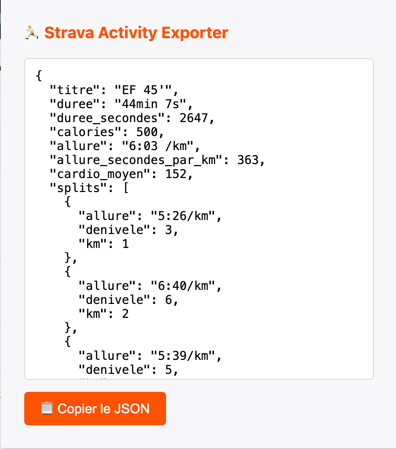
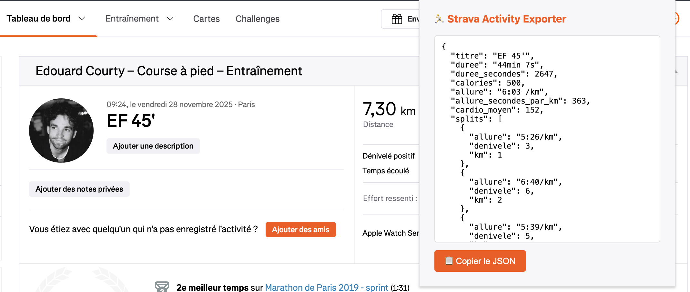

# 🏃 Strava Activity Exporter

Chrome extension to export your Strava activities to JSON.

## Features

Automatically extracts from any Strava activity page:

- **Title** of the activity
- **Duration** of the effort
- **Calories** burned
- **Average pace**
- **Average heart rate**
- **Splits per kilometer** with pace and elevation

## Installation

### From Chrome Web Store
*(Coming soon)*

### Manually
1. Download this repository
2. Open `chrome://extensions/`
3. Enable **Developer mode**
4. Click **Load unpacked**
5. Select the `extension/` folder

## Usage

1. Open an activity on Strava (`strava.com/activities/...`)
2. Click on the extension icon
3. JSON appears automatically
4. Click **Copy JSON**

## Output example

```json
{
  "title": "Morning run 🌅",
  "duration": "44min 7s",
  "duration_seconds": 2647,
  "calories": 500,
  "pace": "6:03 /km",
  "pace_seconds_per_km": 363,
  "average_heart_rate": 152,
  "splits": [
    { "km": 1, "pace": "5:26/km", "elevation": 3 },
    { "km": 2, "pace": "6:40/km", "elevation": 6 },
    { "km": 3, "pace": "5:39/km", "elevation": 5 }
  ]
}
```

## Demonstration





## License

[MIT](LICENSE)

## For AI agents

See [AGENTS.md](AGENTS.md) for technical documentation aimed at code agents and developers.

---

© 2025 Edouard Courty
